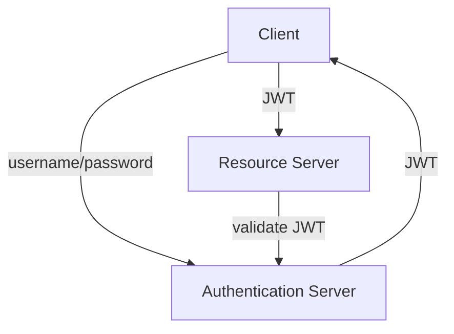

# JWT Integration in Express.js

---

## **1. Embedding JWT into Express.js**

### **1.1 Overview**
- **JWT** is a compact and self-contained token used for:
  - **Authentication:** Identifying users.
  - **Authorization:** Controlling access to resources.

### **1.2 Steps to Implement JWT**
1. **Generate a JWT upon user login:**
   ```javascript
   const jwt = require('jsonwebtoken');

   const generateToken = (user) => {
       const payload = { id: user.id, role: user.role };
       return jwt.sign(payload, process.env.JWT_SECRET, { expiresIn: '1h' });
   };
   ```
   - Payload contains user-specific information (e.g., `id`, `role`).
   - Use `.env` for secure storage of `JWT_SECRET`.

2. **Embed the JWT in responses:**
   ```javascript
   app.post('/login', async (req, res) => {
       const { username, password } = req.body;
       const user = await authenticateUser(username, password);
       if (user) {
           const token = generateToken(user);
           res.json({ token });
       } else {
           res.status(401).json({ message: 'Invalid credentials' });
       }
   });
   ```

3. **Verify the token in incoming requests:**
   - Middleware ensures every request is validated before processing.

---

## **2. Middleware for Request Verification**

### **2.1 Authentication Middleware**
Validates JWTs before allowing access to routes.
```javascript
const authenticateToken = (req, res, next) => {
    const token = req.headers['authorization']?.split(' ')[1]; // Extract Bearer token

    if (!token) return res.status(401).json({ message: 'Token required' });

    jwt.verify(token, process.env.JWT_SECRET, (err, user) => {
        if (err) return res.status(403).json({ message: 'Invalid token' });
        req.user = user; // Attach user data to the request object
        next();
    });
};
```

### **2.2 Role-Based Authorization Middleware**
Restricts access based on user roles.
```javascript
const authorizeRoles = (roles) => (req, res, next) => {
    if (!roles.includes(req.user.role)) {
        return res.status(403).json({ message: 'Access denied' });
    }
    next();
};

// Example usage
app.get('/admin', authenticateToken, authorizeRoles(['admin']), (req, res) => {
    res.send('Welcome Admin');
});
```

---

## **3. Security Measures**

### **3.1 Token Expiration**
- Short expiration times for access tokens (e.g., `15m`).
- Use refresh tokens for long-lived sessions.
  ```javascript
  jwt.sign(payload, secret, { expiresIn: '15m' });
  ```

### **3.2 Secure Secret Management**
- Store secrets in `.env` files.
- Use tools like **AWS Secrets Manager** or **Azure Key Vault**.

### **3.3 HTTPS Enforcement**
- Ensure all client-server communication is encrypted.

### **3.4 Prevent Token Replay Attacks**
- Maintain a blacklist of revoked tokens.
- Use `jti` (JWT ID) claims to detect reused tokens.

---

## **4. Authentication System Design**

### **4.1 Workflow**
1. **User Login:**
   - User provides credentials (username/password).
   - Credentials validated against the database.
   - JWT issued upon successful authentication.

2. **Protected Routes:**
   - Client sends JWT in the `Authorization` header.
   - Middleware validates the JWT and authorizes access.

3. **Logout:**
   - Invalidate the token on the client-side.
   - Optionally maintain a server-side blacklist.

### **4.2 Diagram**


---

## **5. Conclusion**

### **Key Takeaways**
- **Role-based authorization:** Ensures fine-grained access control.
- **Token expiration:** Improves security and session management.
- **Centralized error handling:** Simplifies debugging.
- **Audit logging:** Tracks critical events for better traceability.

### **Next Steps**
- Implement these best practices in your Express.js backend.
- Regularly audit and test your authentication system for vulnerabilities.
